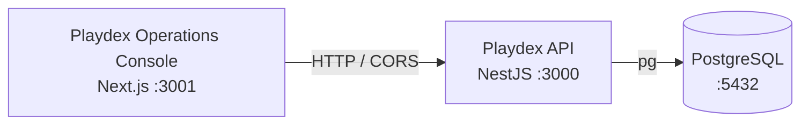

# Azure Debug Plan

> This plan is the source of truth for generating the
> VS Code debug setup in this workspace.
>
> **Status:** Executing
> **Execution Mode:** Auto
> **Created:** 2026-09-20T00:00:00Z
> **Last Updated:** 2026-09-20T00:00:00Z

## Prerequisites

| Tool / Extension | Category | Service(s) | Installed | Version |
|------------------|----------|------------|-----------|---------|
| Node.js | Runtime | backend, frontend | ✅ | 22.16.0 |
| npm | Package manager | backend, frontend | ✅ | 11.4.1 |
| PostgreSQL client (psql) | Database tooling | backend | ❓ | — |
| Docker Compose | Orchestration | backend | ❓ | — |
| Azure CLI | Tooling | backend, frontend | ❓ | — |
| Docker Desktop / Docker Engine | Container runtime | backend | ❓ | — |
| VS Code extension: ms-azuretools.vscode-docker | Debug tooling | backend | ❓ | — |
| VS Code JavaScript Debugger | Debug tooling | backend, frontend | ✅ | Built-in |

> ⚠️ **Action required:** Confirm any tool or extension marked ❓ is installed and ready before approving this plan — rerun the recheck to confirm CLI tools provided by a version manager.

## Debug Configurations

| Generate | Debug Config Name | Service Label | Service Root | Project Type | Runtime | Version | Azure Dependencies |
|----------|-------------------|---------------|--------------|--------------|---------|---------|---------------------|
| [x] | Playdex API (debug) | Playdex API | ./ | app-service | node-ts | 22.16.0 | PostgreSQL |
| [x] | Playdex Operations Console (debug) | Playdex Operations Console | ./frontend | frontend-spa | node-ts | 22.16.0 | — |
| [x] | Debug All Services | Debug All Services | — | *Compound Config* | — | — | — |

ℹ️ Project Type Descriptions

| Project Type | Description |
|-------------|-------------|
| app-service | HTTP server application implemented with NestJS and served by Node.js. |
| frontend-spa | Next.js App Router web application served by a Node.js development server. |

> ℹ️ **Integration:** The frontend calls the API directly at `NEXT_PUBLIC_API_BASE_URL` (default `http://localhost:3000`); no Next.js rewrite or proxy was detected. The API enables CORS for the local frontend origin.

## Orchestrator

| Orchestrator | Container Runtime | Compose Command | Description |
|-------------|-------------------|-----------------|-------------|
| Docker Compose | Docker | `docker compose` | Default Compose provider for the PostgreSQL emulator because no Docker or Podman runtime was confirmed during scanning. |

## Emulators

| Dependent Service | Emulator | Purpose |
|-------------------|----------|---------|
| PostgreSQL | PostgreSQL Container | Local relational database for users, organizations, venues, events, event types, and bookings. |

## Architecture Diagram

During local debugging, the Next.js console and NestJS API run as separate Node.js services while the API connects to a PostgreSQL container; the frontend reaches the API at `localhost:3000`.

## Migrations

When selected, the generation phase creates automated VS Code tasks that run migration setup before the API starts debugging. The NestJS database module already applies ordered raw SQL files from `libs/database/migrations` during module initialization.

| Generate | Service | Migration Tool |
|----------|---------|---------------|
| [x] | Playdex API | Raw SQL migration runner |

## API Test Collections

When selected, the generation phase produces lightweight, runnable API test scripts so the routes can be smoke-tested once the API and PostgreSQL emulator are running.

| Generate | Service | Description |
|----------|---------|-------------|
| [x] | Playdex API | 

HTTP Endpoints (39)
 GET / GET /users GET /users/:id POST /users PUT /users/:id DELETE /users/:id POST /users/migrate GET /organization GET /organization/:id POST /organization PATCH /organization/:id DELETE /organization/:id POST /organization/migrate GET /venues GET /venues/:id POST /venues PUT /venues/:id DELETE /venues/:id POST /venues/migration GET /venues/migration/sql GET /events GET /events/:id POST /events PUT /events/:id DELETE /events/:id POST /events/migration GET /event-types GET /event-types/:id POST /event-types PUT /event-types/:id DELETE /event-types/:id POST /event-types/migration GET /event-types/migration/sql GET /bookings GET /bookings/:id POST /bookings PUT /bookings/:id DELETE /bookings/:id POST /bookings/migration  
 |

## Convenience Scripts

| Generate | Script | Registered In | Description |
|----------|--------|---------------|-------------|
| [x] | emulators:start | ./package.json | Start the PostgreSQL emulator in the background using the configured Compose provider. |
| [x] | emulators:stop | ./package.json | Stop the local PostgreSQL emulator. |
| [x] | emulators:clean | ./package.json | Stop the emulator and remove its local data for a fresh database. |
| [x] | db:migrate | ./package.json | Run the API migration setup against the local PostgreSQL database. |

## Debug Configuration Checklist

Debug Configuration Checklist:
❌ Playdex API (debug) — build validation succeeded via `npm run build`; runtime validation is blocked because Docker is not installed in this environment (`docker info` -> CommandNotFoundException).
❌ Playdex Operations Console (debug) — generated and validated for JSON/task shape; frontend runtime validation requires a local Next.js dev server and a running API/emulator stack.
❌ Debug All Services — compound orchestration cannot be proven here because the PostgreSQL emulator cannot start without Docker/Compose available.